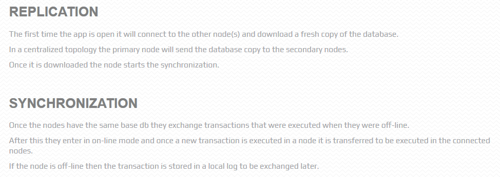

# About

这是一个基于node.js的sqlite demo项目。

server.js是一个基础sqlite服务，使用better-sqlite3实现。

server-litesync-node*.js是基于 [better-sqlite3-litesync](https://litesync.io/) 实现的具有自动同步功能的sqlite服务。

> 本示例采用星型网络拓扑结构，node1为主节点，node2和node3为副节点
> 

# Install Dependencies

better-sqlite3-litesync包的安装需要一些前置步骤，否则会安装失败。

详情查看 [litesync前置编译官方文档](https://litesync.io/compiling.html)

# License

This project is licensed under the MIT License - see the [LICENSE](LICENSE) file for details.